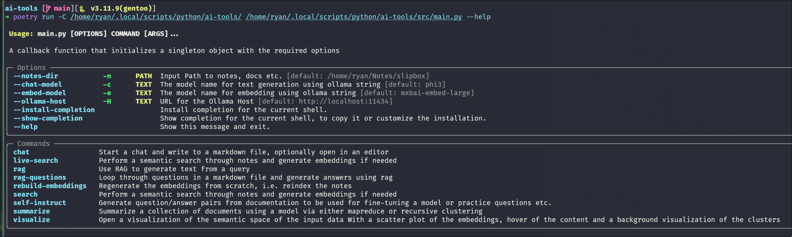
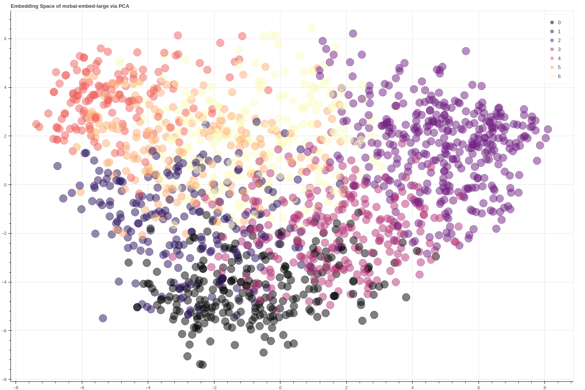
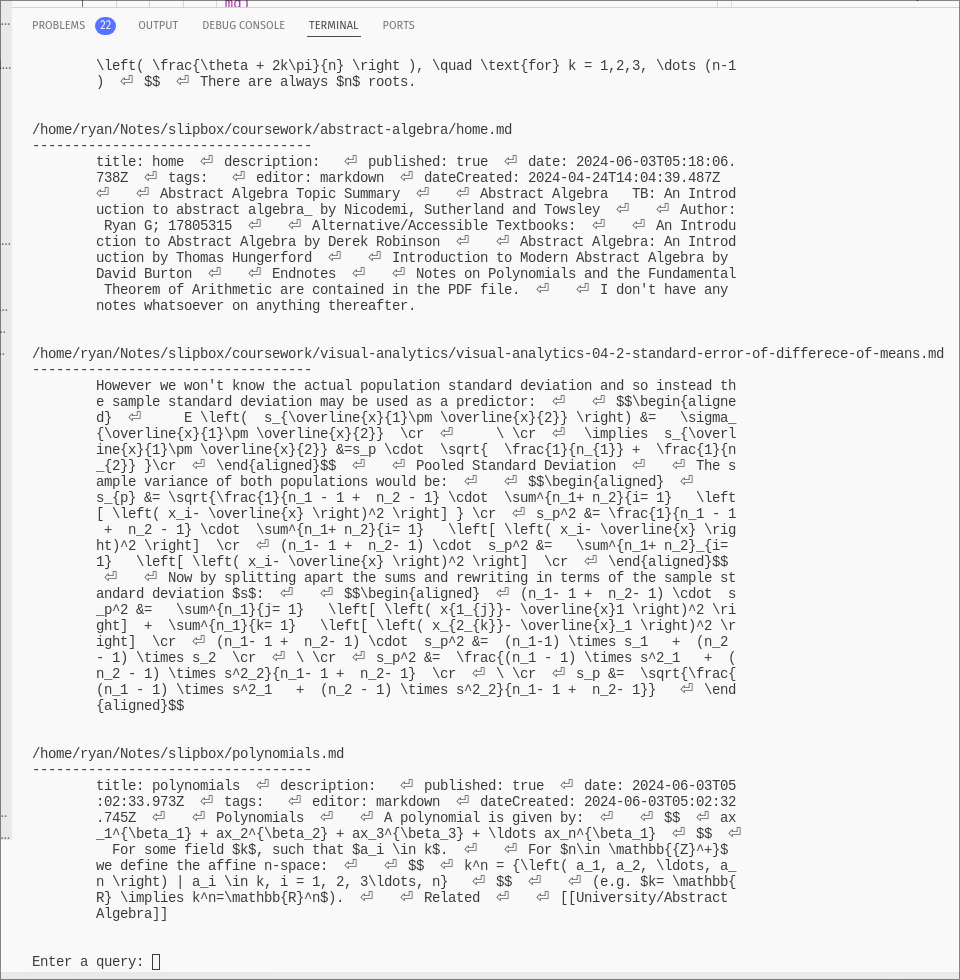

# AI Tools
AI Tools for ollama that provide a basic workflow for search, chat, rag and visualization.

Installi

Read [the documentation](./docs/index.md) for more information.

Install with poetry:

```sh
git clone https://github.com/RyanGreenup/ai-tools
cd ai-tools
poetry install
poetry run src/main.py -n ~/Notes/slipbox live-search
```

This tool provides a simple way to chat with ollama in any editor, search notes using semantic space embeddings and visualize the semantic distribution of notes.

## Screenshots

### CLI

### Embedding Space

### Semantic Search



## TODO

- [x] Chat
- [x] RAG
- [x] Visualization
- [x] Search
    - [x] Live Search
- [ ] RAG generate Answers over question sets to generate answers
- [ ] Question / Answer Generation
- [ ] Documentation summaries using
    - [ ] Map Reduce
    - [ ] Semantic Space Clustering
